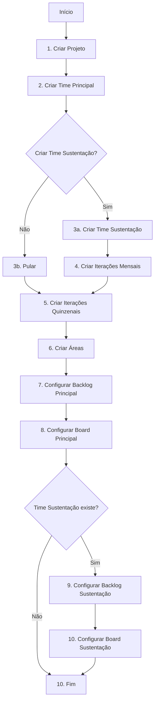

# Integração com APIs REST da Microsoft Azure DevOps

## Visão Geral

O sistema utiliza as **APIs REST oficiais da Microsoft Azure DevOps** (versão 7.1) para automação completa da criação e configuração de projetos.

**Documentação Oficial:** https://learn.microsoft.com/en-us/rest/api/azure/devops

## Autenticação

### Personal Access Token (PAT)

A autenticação é feita via **Personal Access Token** usando Basic Authentication:

```
Authorization: Basic base64(:PAT)
```

**Permissões necessárias no PAT:**
- ✅ **Project** (Read, Write, Manage)
- ✅ **Team** (Read, Write)
- ✅ **Work Items** (Read, Write)
- ✅ **Build** (Read, Write)
- ✅ **Code** (Read, Write)

### Configuração no Sistema

1. Acesse **Configurações → Azure DevOps**
2. Preencha:
   - **URL da Organização:** `https://dev.azure.com/sua-organizacao`
   - **Personal Access Token:** Token gerado no Azure DevOps
3. Salve as configurações

## APIs Utilizadas

### 1. Core API - Projects

#### Criar Projeto

```http
POST https://dev.azure.com/{organization}/_apis/projects?api-version=7.1
```

**Payload:**
```json
{
  "name": "Nome do Projeto",
  "description": "Descrição do projeto",
  "visibility": "private",
  "capabilities": {
    "versioncontrol": {
      "sourceControlType": "Git"
    },
    "processTemplate": {
      "templateTypeId": "adcc42ab-9882-485e-a3ed-7678f01f66bc"
    }
  }
}
```

**Templates de Processo:**
- **Scrum:** `adcc42ab-9882-485e-a3ed-7678f01f66bc`
- **Agile:** `b8a3a935-7e91-48b8-a94c-606d37c3e9f2`
- **CMMI:** `27450541-8e31-4150-9947-dc59f998fc01`
- **Basic:** `b8a3a935-7e91-48b8-a94c-606d37c3e9f9`

**Resposta:**
```json
{
  "id": "project-guid",
  "name": "Nome do Projeto",
  "url": "https://dev.azure.com/org/_apis/projects/project-guid",
  "state": "wellFormed",
  "revision": 1
}
```

**Implementação:**
```javascript
// server/azure-devops-service.js linha 80
async createOrUpdateProject(projectName, processTemplate, description)
```

**Documentação:** https://learn.microsoft.com/en-us/rest/api/azure/devops/core/projects/create

---

#### Obter Projeto

```http
GET https://dev.azure.com/{organization}/_apis/projects/{projectName}?api-version=7.1
```

**Implementação:**
```javascript
// server/azure-devops-service.js linha 125
async getProject(projectName)
```

---

#### Verificar Status da Operação

```http
GET https://dev.azure.com/{organization}/_apis/operations/{operationId}?api-version=7.1
```

A criação de projetos é **assíncrona**. Use esta API para verificar se a operação foi concluída.

**Implementação:**
```javascript
// server/azure-devops-service.js linha 140
async waitForProjectCreation(operationId)
```

---

### 2. Core API - Teams

#### Criar Time

```http
POST https://dev.azure.com/{organization}/_apis/projects/{projectName}/teams?api-version=7.1
```

**Payload:**
```json
{
  "name": "Nome do Time",
  "description": "Descrição do time"
}
```

**Resposta:**
```json
{
  "id": "team-guid",
  "name": "Nome do Time",
  "url": "https://dev.azure.com/org/_apis/projects/project/teams/team-guid",
  "description": "Descrição do time",
  "identityUrl": "https://vssps.dev.azure.com/org/_apis/Identities/team-guid"
}
```

**Implementação:**
```javascript
// server/azure-devops-service.js linha 180
async createOrGetTeam(projectName, teamName, description)
```

**Documentação:** https://learn.microsoft.com/en-us/rest/api/azure/devops/core/teams/create

---

### 3. Work Item Tracking API - Classification Nodes

#### Criar Iteração (Sprint)

```http
POST https://dev.azure.com/{organization}/{project}/_apis/wit/classificationnodes/iterations?api-version=7.1
```

**Payload:**
```json
{
  "name": "Sprint 1",
  "attributes": {
    "startDate": "2024-01-01T00:00:00Z",
    "finishDate": "2024-01-14T23:59:59Z"
  }
}
```

**Estrutura de Iterações Criadas:**

**Time Principal (26 sprints quinzenais):**
```
Projeto
└── Sprint 1 (01/01 - 14/01)
└── Sprint 2 (15/01 - 28/01)
└── Sprint 3 (29/01 - 11/02)
└── ...
└── Sprint 26 (26/06 - 09/07)
```

**Time Sustentação (24 iterações mensais):**
```
Projeto
└── Janeiro/2024
└── Fevereiro/2024
└── Março/2024
└── ...
└── Dezembro/2025
```

**Implementação:**
```javascript
// server/azure-devops-service.js linha 220
async createIterations(projectName, teamName, options)
async createBiweeklyIterations(projectName, parentIteration, startDate)
async createMonthlyIterations(projectName, parentIteration)
```

**Documentação:** https://learn.microsoft.com/en-us/rest/api/azure/devops/wit/classification-nodes

---

#### Criar Área

```http
POST https://dev.azure.com/{organization}/{project}/_apis/wit/classificationnodes/areas?api-version=7.1
```

**Payload:**
```json
{
  "name": "backend-Java",
  "children": []
}
```

**Estrutura de Áreas por Repositório:**
```
Projeto
├── backend-Java
├── frontend-Angular
├── mobile-Flutter
└── database-PostgreSQL
```

**Implementação:**
```javascript
// server/azure-devops-service.js linha 355
async createAreas(projectName, areas)
```

---

### 4. Work API - Team Settings

#### Configurar Backlog do Time

```http
GET/PATCH https://dev.azure.com/{organization}/{project}/{team}/_apis/work/teamsettings?api-version=7.1
```

**Configurações aplicadas:**
- Backlog Levels: Epics, Features, Stories
- Working Days: Segunda a Sexta
- Bug Behavior: As Requirements

**Implementação:**
```javascript
// server/azure-devops-service.js linha 380
async configureTeamBacklog(projectName, teamName)
```

**Documentação:** https://learn.microsoft.com/en-us/rest/api/azure/devops/work/team-settings

---

#### Configurar Board do Time

```http
GET/PUT https://dev.azure.com/{organization}/{project}/{team}/_apis/work/boards/{board}/columns?api-version=7.1
```

**Colunas do Board:**
1. **Backlog** (Proposed)
2. **A Fazer** (Proposed)
3. **Em Análise** (InProgress)
4. **Desenvolvimento** (InProgress)
5. **Code Review** (InProgress)
6. **Testes** (InProgress)
7. **Concluído** (Resolved)

**Swimlanes:**
- **Expedite** (cor vermelha)
- **Normal** (cor azul)
- **Low Priority** (cor cinza)

**Card Styles (Prioridade):**
- **Prioridade 1:** Vermelho (#cc293d)
- **Prioridade 2:** Laranja (#ff6600)
- **Prioridade 3:** Amarelo (#ffcc00)

**Card Styles (Tags):**
- **PL_SQL:** Vermelho (#cc293d)
- **JAVA:** Azul (#0078d4)
- **PHP:** Roxo (#8b4789)
- **OUTROS:** Verde (#107c10)

**Implementação:**
```javascript
// server/azure-devops-service.js linha 410
async configureTeamBoard(projectName, teamName)
```

**Documentação:** https://learn.microsoft.com/en-us/rest/api/azure/devops/work/boards

---

### 5. Process Template API

#### Obter Templates de Processo

```http
GET https://dev.azure.com/{organization}/_apis/process/processes?api-version=7.1
```

**Templates Disponíveis:**
- Scrum
- Agile
- CMMI
- Basic

**Implementação:**
```javascript
// server/azure-devops-service.js linha 155
async getProcessTemplateId(templateName)
```

---

## Fluxo de Criação Completo

### Método Principal: `setupCompleteProject()`

**Arquivo:** `server/azure-devops-service.js` linha 530

**Sequência de Operações:**



**Código:**
```javascript
const service = new AzureDevOpsService(organization, pat);

const result = await service.setupCompleteProject({
  projectName: 'Meu Projeto',
  workItemProcess: 'Scrum',
  teamName: 'Time Principal',
  startDate: '2024-01-01',
  criarTimeSustentacao: true,
  areas: [
    { name: 'backend-Java', path: null },
    { name: 'frontend-Angular', path: null }
  ]
});
```

**Resultado:**
```json
{
  "project": {
    "id": "project-guid",
    "name": "Meu Projeto",
    "url": "https://dev.azure.com/org/Meu%20Projeto"
  },
  "teams": [
    { "id": "team1-guid", "name": "Time Principal" },
    { "id": "team2-guid", "name": "Sustentação" }
  ],
  "iterations": [
    { "name": "Sprint 1", "startDate": "2024-01-01", "finishDate": "2024-01-14" },
    { "name": "Sprint 2", "startDate": "2024-01-15", "finishDate": "2024-01-28" },
    ...
  ],
  "areas": [
    { "id": "area1-guid", "name": "backend-Java" },
    { "id": "area2-guid", "name": "frontend-Angular" }
  ],
  "configurations": [
    { "team": "Time Principal", "status": "configured" },
    { "team": "Sustentação", "status": "configured" }
  ]
}
```

---

## Uso no Sistema

### 1. Via Interface Web

1. Acesse **Integrador** no menu
2. Clique em **Novo Projeto**
3. Preencha os dados:
   - Produto
   - Projeto
   - Process Template
   - Nome do Time
   - Data Inicial
   - Repositórios
4. Clique em **Salvar e Criar no Azure**

### 2. Via API REST

```bash
curl -X POST http://localhost:3000/api/azure-devops/setup-project \
  -H "Content-Type: application/json" \
  -d '{
    "organization": "sua-organizacao",
    "pat": "seu-personal-access-token",
    "projectName": "Projeto Teste",
    "workItemProcess": "Scrum",
    "teamName": "Time Principal",
    "startDate": "2024-01-01",
    "criarTimeSustentacao": true,
    "areas": [
      { "name": "backend-Java", "path": null },
      { "name": "frontend-Angular", "path": null }
    ]
  }'
```

### 3. Programaticamente

```javascript
import AzureDevOpsService from './server/azure-devops-service.js';

const service = new AzureDevOpsService('sua-organizacao', 'seu-pat');

const result = await service.setupCompleteProject({
  projectName: 'Novo Projeto',
  workItemProcess: 'Agile',
  teamName: 'Equipe Alpha',
  startDate: '2024-02-01',
  criarTimeSustentacao: false,
  areas: [
    { name: 'api-rest', path: null },
    { name: 'web-app', path: null }
  ]
});

console.log('Projeto criado:', result);
```

---

## Logs e Debug

### Console Logs

O sistema registra todas as chamadas às APIs da Microsoft:

```
[Azure DevOps API] POST https://dev.azure.com/org/_apis/projects?api-version=7.1
[Azure DevOps API] Sucesso: POST /_apis/projects
[Microsoft API] Criando projeto Meu Projeto com template Scrum
Criando projeto Meu Projeto...
Criando time Time Principal...
Criando iterações...
Criando áreas...
```

### Debug Detalhado

Ative o debug no frontend abrindo o console (F12). Você verá:

```
═══════════════════════════════════════════════════
🚀 CRIAÇÃO DE PROJETO NO AZURE DEVOPS
═══════════════════════════════════════════════════
Endpoint: /api/azure-devops/setup-project
Organização: sua-organizacao
Projeto: Meu Projeto
Process Template: Scrum
Time: Time Principal
Data Inicial: 2024-01-01
Criar Time Sustentação: true
Áreas/Repositórios: ['backend-Java', 'frontend-Angular']
───────────────────────────────────────────────────
Payload Completo: { ... JSON completo ... }
═══════════════════════════════════════════════════
```

### Verificar Logs de Erro

```sql
-- Últimos erros do Azure DevOps
SELECT 
  timestamp,
  event_name,
  error_message,
  JSON_EXTRACT(attributes, '$.projeto_nome') as projeto,
  JSON_EXTRACT(attributes, '$.status_code') as http_status
FROM logs_auditoria
WHERE event_name LIKE '%azure%'
ORDER BY timestamp DESC
LIMIT 20;
```

---

## Limitações e Boas Práticas

### Rate Limiting

A Microsoft Azure DevOps aplica rate limiting:
- **User-based:** 200 requisições por minuto
- **Organization-based:** 5000 requisições por minuto

**Recomendação:** O sistema já implementa delays entre operações sequenciais.

### Timeouts

- Criação de projeto: Até 60 segundos (assíncrono)
- Outras operações: 30 segundos

### Boas Práticas

1. ✅ **Sempre validar** o PAT antes de criar projetos
2. ✅ **Verificar se o projeto existe** antes de criar
3. ✅ **Usar nomes únicos** para projetos e times
4. ✅ **Monitorar logs** para identificar falhas
5. ✅ **Guardar os IDs** retornados pelas APIs
6. ✅ **Implementar retry** para operações que falharam

---

## Troubleshooting

### Erro: "Access Denied"

**Causa:** PAT sem permissões ou expirado

**Solução:**
1. Gere um novo PAT no Azure DevOps
2. Garanta as permissões: Project (Full), Team (Full), Work Items (Full)
3. Atualize nas configurações do sistema

### Erro: "Project already exists"

**Causa:** Projeto com mesmo nome já existe

**Solução:**
1. Use outro nome
2. Ou delete o projeto existente no Azure DevOps

### Erro: "Invalid process template"

**Causa:** Nome do template incorreto

**Solução:**
Use apenas: `Scrum`, `Agile`, `CMMI` ou `Basic`

### Erro: "Operation timeout"

**Causa:** Azure DevOps está lento ou sobrecarregado

**Solução:**
1. Aguarde alguns minutos
2. Tente novamente
3. Verifique status do Azure DevOps: https://status.dev.azure.com

---

## Referências

- **Documentação Oficial:** https://learn.microsoft.com/en-us/rest/api/azure/devops
- **Core API:** https://learn.microsoft.com/en-us/rest/api/azure/devops/core
- **Work Item Tracking API:** https://learn.microsoft.com/en-us/rest/api/azure/devops/wit
- **Work API:** https://learn.microsoft.com/en-us/rest/api/azure/devops/work
- **Autenticação:** https://learn.microsoft.com/en-us/azure/devops/organizations/accounts/use-personal-access-tokens-to-authenticate

---

## Suporte

Para dúvidas ou problemas:

1. Consulte `/docs/DEBUG_AZURE_DEVOPS.md`
2. Consulte `/docs/TROUBLESHOOTING_RUNBOOK.md`
3. Verifique logs em `logs_auditoria` table
4. Abra o console do navegador (F12) para ver logs detalhados
