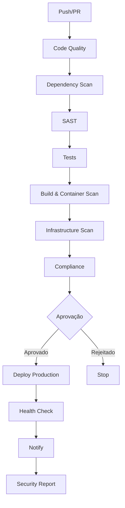

# Pipeline DevSecOps - Guia de Configuração

Pipeline completa de CI/CD com práticas DevSecOps para deployment seguro em produção.

## 📋 Índice

- [Visão Geral](#visão-geral)
- [Etapas da Pipeline](#etapas-da-pipeline)
- [Configuração de Secrets](#configuração-de-secrets)
- [Ferramentas de Segurança](#ferramentas-de-segurança)
- [Como Usar](#como-usar)
- [Troubleshooting](#troubleshooting)

---

## 🎯 Visão Geral

Esta pipeline implementa as melhores práticas de DevSecOps, incluindo:

- ✅ **Code Quality** - ESLint, Prettier, TypeScript
- 🔒 **Security Scanning** - SAST, DAST, SCA
- 📦 **Dependency Analysis** - npm audit, Snyk, OWASP
- 🐳 **Container Security** - Trivy, Dockle, Docker Bench
- 🧪 **Automated Testing** - Unit, Integration, E2E
- 📊 **Compliance** - License check, SBOM generation
- 🚀 **Zero-Downtime Deployment**
- 📧 **Notifications** - Slack, Email
- 📈 **Monitoring & Reporting**

---

## 🔄 Etapas da Pipeline

### 1. **Code Quality Analysis**
- ESLint para análise estática
- Prettier para formatação
- TypeScript type checking
- Análise de complexidade de código

### 2. **Dependency Security Scan**
- `npm audit` para vulnerabilidades conhecidas
- Snyk para análise de dependências
- OWASP Dependency Check
- Dependency Review (em PRs)

### 3. **SAST (Static Application Security Testing)**
- **CodeQL** - Análise semântica avançada
- **Semgrep** - Regras de segurança customizadas
- **GitLeaks** - Detecção de secrets no código
- Queries: `security-extended`, `security-and-quality`

### 4. **Automated Testing**
- Testes unitários
- Testes de integração
- Coverage report
- Banco de dados MySQL de teste

### 5. **Build & Container Security**
- Build de imagem Docker otimizada
- **Trivy** - Scan de vulnerabilidades em imagens
- **Snyk Container** - Análise de layers
- **Dockle** - Best practices Docker
- **CIS Docker Benchmark** - Compliance

### 6. **Infrastructure Security**
- Tfsec para Terraform (se aplicável)
- Checkov para IaC
- Kubernetes security scan
- Docker Compose validation

### 7. **Compliance Checks**
- License compliance
- Sensitive data detection
- SBOM (Software Bill of Materials)
- Security policy validation

### 8. **Deployment to Production**
- Login seguro via SSH
- Backup automático do banco
- Deploy com zero downtime
- Database migrations
- Health checks
- Post-deployment DAST

### 9. **Monitoring & Notifications**
- Notificações Slack
- Notificações Email
- Status updates
- Deployment logs

### 10. **Security Report**
- Relatório consolidado
- Upload de artifacts
- PR comments com status
- Retention de 90 dias

---

## 🔐 Configuração de Secrets

Configure os seguintes secrets no GitHub (`Settings > Secrets and variables > Actions`):

### Obrigatórios para Produção

```bash
# Servidor de Produção
PROD_HOST=seu-servidor.com
PROD_USER=deploy
PROD_SSH_KEY=<sua-chave-privada-ssh>
PROD_PORT=22
PROD_URL=https://seu-dominio.com

# MySQL Produção
MYSQL_ROOT_PASSWORD=<senha-segura>
```

### Ferramentas de Segurança

```bash
# Snyk (https://snyk.io)
SNYK_TOKEN=<seu-snyk-token>

# CodeCov (https://codecov.io)
CODECOV_TOKEN=<seu-codecov-token>

# GitLeaks (opcional)
GITLEAKS_LICENSE=<sua-licenca>
```

### Cloud Provider (Opcional)

```bash
# AWS
AWS_ACCESS_KEY_ID=<seu-access-key>
AWS_SECRET_ACCESS_KEY=<seu-secret-key>
AWS_REGION=us-east-1

# Azure
AZURE_CREDENTIALS=<seu-service-principal>

# GCP
GCP_SA_KEY=<sua-service-account-key>
```

### Notificações

```bash
# Slack
SLACK_WEBHOOK=https://hooks.slack.com/services/YOUR/WEBHOOK/URL

# Email
MAIL_SERVER=smtp.gmail.com
MAIL_PORT=587
MAIL_USERNAME=seu-email@gmail.com
MAIL_PASSWORD=<app-password>
NOTIFICATION_EMAIL=equipe@empresa.com
```

---

## 🛠️ Ferramentas de Segurança

### CodeQL
- **Tipo:** SAST
- **Funcionalidade:** Análise semântica de código
- **Configuração:** Automática via GitHub
- **Custo:** Gratuito para repositórios públicos

### Snyk
1. Crie conta em https://snyk.io
2. Gere token de API
3. Adicione como `SNYK_TOKEN` nos secrets
4. Suporta: npm, Docker, IaC

### Trivy
- **Tipo:** Container Scanner
- **Funcionalidade:** Detecta CVEs em imagens
- **Configuração:** Automática
- **Severity:** CRITICAL, HIGH

### Semgrep
- **Tipo:** SAST
- **Funcionalidade:** Pattern matching de código
- **Configuração:** Via config em `.semgrep.yml`
- **Rules:** security-audit, owasp-top-ten

### OWASP Dependency Check
- **Tipo:** SCA
- **Funcionalidade:** Análise de dependências conhecidas
- **Formato:** HTML report
- **Retention:** 7 dias

### Dockle
- **Tipo:** Container Linter
- **Funcionalidade:** Best practices Docker
- **Checks:** CIS Benchmark, Dockerfile quality

---

## 🚀 Como Usar

### Trigger Automático

A pipeline executa automaticamente em:

```yaml
# Push para main
git push origin main

# Pull Request para main
git checkout -b feature/nova-funcionalidade
git push origin feature/nova-funcionalidade
# Criar PR no GitHub

# Manual via workflow_dispatch
# GitHub > Actions > DevSecOps Production > Run workflow
```

### Ambientes

```yaml
# Production (padrão)
- Branch: main
- Deploy: Automático
- Approval: Required (configurar no GitHub)

# Staging (manual)
# Selecionar 'staging' no workflow_dispatch
```

### Aprovação de Deploy

Configure proteção de branch:

```bash
Settings > Environments > production > Required reviewers
```

---

## 📊 Monitoramento

### Artifacts Gerados

A pipeline gera os seguintes artifacts:

| Artifact | Descrição | Retenção |
|----------|-----------|----------|
| `dependency-check-report` | Relatório OWASP | 7 dias |
| `sbom.spdx.json` | Software Bill of Materials | 90 dias |
| `security-report.md` | Relatório consolidado | 90 dias |
| `coverage` | Code coverage report | 30 dias |

### Security Alerts

Alerts são enviados para:
- GitHub Security tab
- Slack (se configurado)
- Email (se configurado)

### Dashboards

Acesse os resultados em:
- **GitHub Actions**: Logs detalhados
- **Security Tab**: Dependabot alerts, CodeQL
- **Snyk Dashboard**: Vulnerabilities overview
- **CodeCov**: Coverage trends

---

## 🔧 Personalização

### Adicionar Steps Customizados

```yaml
- name: Custom Security Check
  run: |
    # Seu script aqui
    ./custom-security-scan.sh
```

### Configurar Thresholds

```yaml
# Ajustar severity levels
severity-threshold: high  # critical, high, medium, low

# Ajustar failure conditions
failure-threshold: 'high'
exit-code: '1'
```

### Environments Adicionais

```yaml
# Adicionar staging
deploy-staging:
  name: Deploy to Staging
  environment:
    name: staging
    url: https://staging.seu-dominio.com
```

---

## 🐛 Troubleshooting

### Pipeline Falha no Dependency Scan

```bash
# Verificar vulnerabilidades
npm audit

# Atualizar dependências
npm audit fix

# Ignorar temporariamente (não recomendado)
npm audit --audit-level=high
```

### Container Scan com Muitos Alertas

```bash
# Atualizar imagem base
FROM node:18-alpine  # Usar alpine slim

# Remover ferramentas desnecessárias
RUN apk del build-dependencies

# Multi-stage build
FROM node:18 as builder
# build steps
FROM node:18-alpine
COPY --from=builder /app /app
```

### Deploy Falha

```bash
# Verificar conectividade SSH
ssh -i ~/.ssh/prod_key user@server

# Verificar logs
docker-compose logs auditoria-app

# Rollback manual
docker-compose down
docker pull previous-image:tag
docker-compose up -d
```

### CodeQL Timeout

```yaml
# Aumentar timeout
timeout-minutes: 360

# Reduzir scope
paths-ignore:
  - 'node_modules/**'
  - 'dist/**'
```

---

## 📚 Referências

### Documentação Oficial

- [GitHub Actions](https://docs.github.com/en/actions)
- [CodeQL](https://codeql.github.com/docs/)
- [Snyk](https://docs.snyk.io/)
- [Trivy](https://aquasecurity.github.io/trivy/)
- [OWASP](https://owasp.org/www-project-dependency-check/)

### Best Practices

- [OWASP DevSecOps](https://owasp.org/www-project-devsecops-guideline/)
- [CIS Docker Benchmark](https://www.cisecurity.org/benchmark/docker)
- [NIST Secure Software Development](https://csrc.nist.gov/publications/detail/sp/800-218/final)

### Security Standards

- [OWASP Top 10](https://owasp.org/www-project-top-ten/)
- [CWE Top 25](https://cwe.mitre.org/top25/)
- [SANS Top 25](https://www.sans.org/top25-software-errors/)

---

## 🔄 Fluxo Completo



---

## 📞 Suporte

Para questões sobre a pipeline:

1. Verifique os logs no GitHub Actions
2. Consulte a documentação das ferramentas
3. Abra uma issue no repositório
4. Contate a equipe DevSecOps

---

## 📝 Changelog

### v1.0.0 (2025-12-22)
- ✨ Pipeline inicial DevSecOps
- 🔒 10 stages de segurança
- 🚀 Deploy automatizado
- 📊 Reporting completo

---

## 📄 Licença

Este workflow está sob a mesma licença do projeto principal.
