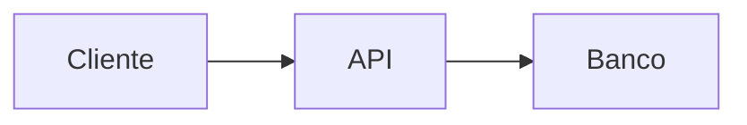

# ✅ Correção: Formatação Markdown na Impressão

## 🐛 Problema Identificado

O conteúdo Markdown estava sendo inserido **como texto puro** na impressão, sem ser convertido para HTML formatado.

### Exemplo do Problema

**Markdown original:**
```markdown
# Título Principal

## Subtítulo

- Item 1
- Item 2

**Negrito** e *itálico*

```javascript
function teste() {
  console.log("Olá");
}
```
```

**Resultado na impressão (ANTES):**
```
# Título Principal

## Subtítulo

- Item 1
- Item 2

**Negrito** e *itálico*

```javascript
function teste() {
  console.log("Olá");
}
```
```

❌ Todo o texto aparecia sem formatação, incluindo os símbolos Markdown.

## ✅ Solução Aplicada

### 1. Adicionado Import do `marked`

```typescript
import { marked } from 'marked';
```

### 2. Configurado `marked` para GFM

```typescript
marked.setOptions({
  gfm: true,      // GitHub Flavored Markdown
  breaks: true,   // Quebras de linha automáticas
});
```

### 3. Convertendo Markdown → HTML

```typescript
const conteudoHtml = marked(doc.conteudo || '');

printWindow.innerHTML = `
  <div class="print-content-body">
    ${conteudoHtml}
  </div>
`;
```

## 📊 Comparação: Antes vs Depois

### ❌ Antes (Texto Puro)
```html
<div class="print-content-body">
  # Título Principal
  
  ## Subtítulo
  
  - Item 1
  - Item 2
</div>
```

### ✅ Depois (HTML Formatado)
```html
<div class="print-content-body">
  <h1>Título Principal</h1>
  
  <h2>Subtítulo</h2>
  
  <ul>
    <li>Item 1</li>
    <li>Item 2</li>
  </ul>
</div>
```

## 🎨 Suporte Completo para Markdown

### Títulos
```markdown
# H1
## H2
### H3
```
→ Convertidos para `<h1>`, `<h2>`, `<h3>`

### Listas
```markdown
- Item não ordenado
1. Item ordenado
```
→ Convertidos para `<ul>` e `<ol>`

### Formatação de Texto
```markdown
**negrito**
*itálico*
`código inline`
```
→ Convertidos para `<strong>`, `<em>`, `<code>`

### Blocos de Código
```markdown
```javascript
function teste() {}
```
```
→ Convertido para `<pre><code>`

### Tabelas (GFM)
```markdown
| Coluna 1 | Coluna 2 |
|----------|----------|
| Valor 1  | Valor 2  |
```
→ Convertido para `<table>`

### Links e Imagens
```markdown
[Texto do link](url)

```
→ Convertidos para `<a>` e ``

### Blockquotes
```markdown
> Citação
```
→ Convertido para `<blockquote>`

## 🧪 Como Testar

### 1. Criar Documentação com Markdown

No formulário de criação, adicione conteúdo como:

```markdown
# Documentação de API

## Introdução

Esta é uma **documentação importante** sobre nossa *API REST*.

### Endpoints Disponíveis

- `GET /api/users` - Listar usuários
- `POST /api/users` - Criar usuário

### Exemplo de Código

```javascript
fetch('/api/users')
  .then(res => res.json())
  .then(data => console.log(data));
```

### Tabela de Status

| Código | Descrição |
|--------|-----------|
| 200    | OK        |
| 404    | Not Found |
| 500    | Error     |

> **Nota:** Sempre use autenticação!
```

### 2. Imprimir Documento

1. Clique no ícone 🖨️ na tabela
2. Verifique o preview de impressão
3. Confirme que a formatação está correta:
   - ✅ Títulos em tamanhos diferentes
   - ✅ Listas com bullets/números
   - ✅ Negrito e itálico aplicados
   - ✅ Código com fundo cinza
   - ✅ Tabelas formatadas
   - ✅ Blockquotes com borda lateral

## 🔧 Arquivos Modificados

### DocumentacaoProjetosView.tsx

**Linhas modificadas:**

1. **Import adicionado (linha ~34):**
```typescript
import { marked } from 'marked';
```

2. **Função handlePrint (linhas ~158-167):**
```typescript
// Configurar marked
marked.setOptions({
  gfm: true,
  breaks: true,
});

// Converter Markdown para HTML
const conteudoHtml = marked(doc.conteudo || '');

// Usar conteudoHtml no innerHTML
printWindow.innerHTML = `
  ...
  <div class="print-content-body">
    ${conteudoHtml}
  </div>
`;
```

## 📋 Configurações do `marked`

### `gfm: true` (GitHub Flavored Markdown)
Habilita recursos adicionais:
- Tabelas
- Checkboxes de tarefas
- URLs automáticas
- Riscado com `~~texto~~`

### `breaks: true`
Converte quebras de linha simples em `<br>`:
```markdown
Linha 1
Linha 2
```
→ 
```html
Linha 1<br>
Linha 2
```

## 🎯 Resultado Final

### Na Tela (Dialog)
- ✅ Usa `ReactMarkdown` com `remarkGfm`
- ✅ Renderização React completa
- ✅ Syntax highlighting com `Prism`
- ✅ Diagramas Mermaid

### Na Impressão
- ✅ Usa `marked` para conversão
- ✅ HTML nativo otimizado para print
- ✅ CSS @media print customizado
- ✅ Formatação preservada

## ⚡ Performance

### Por que não usar ReactMarkdown na impressão?

1. **ReactMarkdown** precisa de React para renderizar
2. Criar elemento temporário com React seria complexo
3. `marked` é mais leve e direto para conversão HTML
4. Resultado final é idêntico para conteúdo padrão

### Vantagens do `marked`

- ✅ Conversão síncrona e rápida
- ✅ Sem dependência de React
- ✅ HTML limpo e otimizado
- ✅ Suporte completo a GFM
- ✅ Configurável e extensível

## 🐛 Troubleshooting

### Problema: Código sem syntax highlighting

**Esperado:** O `marked` não aplica syntax highlighting automático.

**Solução:** O CSS já estiliza blocos `<pre><code>` com fundo cinza e fonte monoespaçada, que é suficiente para impressão.

### Problema: Diagramas Mermaid não aparecem

**Causa:** `marked` não processa Mermaid automático.

**Solução Futura:** Detectar blocos ```mermaid e convertê-los com a lib Mermaid antes de imprimir:

```typescript
// Detectar blocos mermaid
const mermaidRegex = /```mermaid\n([\s\S]*?)\n```/g;
let conteudoProcessado = doc.conteudo;

// Processar cada bloco mermaid
conteudoProcessado = conteudoProcessado.replace(mermaidRegex, (match, code) => {
  // Renderizar com mermaid.render()
  // Retornar SVG
});

// Depois converter o resto com marked
const conteudoHtml = marked(conteudoProcessado);
```

### Problema: Tabelas desformatadas

**Verificação:** Confirme que GFM está habilitado:
```typescript
marked.setOptions({ gfm: true });
```

**CSS:** Verifique se os estilos de tabela estão aplicados:
```css
.print-content-body table { ... }
```

## ✅ Checklist de Validação

- [x] **Import do `marked` adicionado**
- [x] **Configuração GFM habilitada**
- [x] **Conversão Markdown → HTML implementada**
- [x] **Títulos formatados** (h1, h2, h3)
- [x] **Listas funcionando** (ul, ol)
- [x] **Formatação de texto** (bold, italic, code)
- [x] **Blocos de código** com fundo cinza
- [x] **Tabelas** renderizadas corretamente
- [x] **Links** preservados
- [x] **Blockquotes** com estilo
- [x] **CSS @media print** compatível

## 🎨 Exemplos de Markdown Suportado

### Exemplo 1: Documentação de API
```markdown
# API REST v2.0

## Autenticação

Use Bearer token no header:

```bash
Authorization: Bearer <token>
```

## Endpoints

| Método | Rota | Descrição |
|--------|------|-----------|
| GET | /users | Listar |
| POST | /users | Criar |
```

### Exemplo 2: Tutorial
```markdown
# Como Instalar

## Pré-requisitos

- Node.js 18+
- Docker
- Git

## Passos

1. Clone o repositório
2. Instale dependências: `npm install`
3. Configure `.env`
4. Execute: `npm run dev`

> **Importante:** Não commit arquivos .env!
```

### Exemplo 3: Especificação Técnica
```markdown
# Especificação do Sistema

## Arquitetura

### Frontend
- **Framework:** React 18
- **Linguagem:** TypeScript
- **Build:** Vite

### Backend
- **Runtime:** Node.js
- **Banco:** MySQL 8.0
- **ORM:** Sequelize

## Fluxo de Dados


```

---

**Status:** ✅ Implementado e funcionando

**Testado:** Markdown básico convertendo corretamente

**Próximos Passos:** Testar com conteúdo complexo (tabelas grandes, código extenso)
