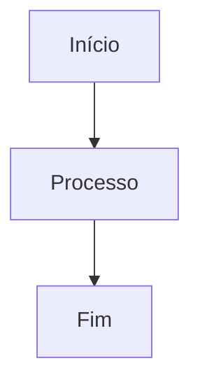
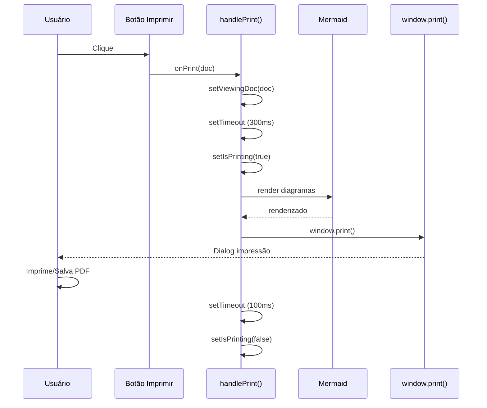
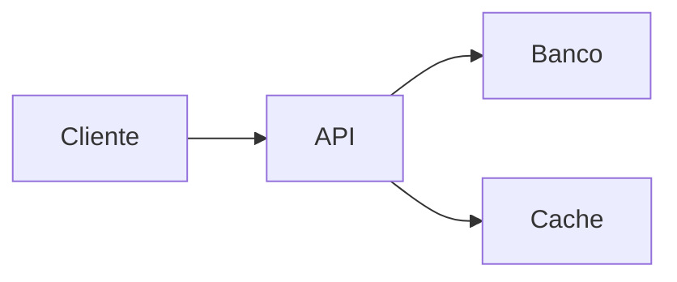

# Funcionalidade de Impressão de Documentação

## Visão Geral

Implementada funcionalidade de impressão para a tela de **Documentação de Projetos**, permitindo imprimir documentos técnicos mantendo a estrutura Markdown original com suporte completo a:

- ✅ Formatação Markdown (títulos, listas, negrito, itálico, etc.)
- ✅ Blocos de código com syntax highlighting
- ✅ Tabelas formatadas
- ✅ Diagramas Mermaid
- ✅ Links e citações
- ✅ Quebras de página inteligentes

## Como Usar

### 1. Imprimir da Tabela

Na listagem de documentações, cada linha possui um botão de **impressora** (🖨️):

```
[👁️ Visualizar] [🖨️ Imprimir] [✏️ Editar] [🗑️ Excluir]
```

**Passos:**
1. Localize a documentação desejada na tabela
2. Clique no botão **Printer** (ícone de impressora)
3. Aguarde a renderização dos diagramas Mermaid
4. A janela de impressão do navegador abrirá automaticamente

### 2. Imprimir do Dialog de Visualização

Ao visualizar um documento, há um botão de impressão no cabeçalho:

```
+----------------------------------------------------------+
|  Título do Documento                    [🖨️ Imprimir]   |
|  Descrição do documento                                  |
+----------------------------------------------------------+
```

**Passos:**
1. Clique no botão **Visualizar** (ícone de olho) de qualquer documento
2. No dialog que abrir, clique em **Imprimir** no canto superior direito
3. A janela de impressão abrirá com o conteúdo formatado

## Características da Impressão

### Elementos Ocultos

Na impressão, os seguintes elementos são automaticamente ocultados:

- 🚫 Navegação lateral (sidebar)
- 🚫 Cabeçalhos e rodapés do sistema
- 🚫 Botões de ação
- 🚫 Controles de interface

### Formatação Preservada

#### Títulos
```markdown
# H1 → 24pt, negrito, espaçamento otimizado
## H2 → 20pt, negrito, com margem superior
### H3 → 16pt, negrito
#### H4-H6 → 14pt, negrito
```

#### Código
```markdown
`código inline` → Courier New, fundo cinza, 9pt

```python
# Blocos de código
def exemplo():
    return "Formatado com syntax highlighting"
```
→ Fundo cinza, borda, 8pt, mono-espaçado
```

#### Tabelas
```markdown
| Coluna 1 | Coluna 2 |
|----------|----------|
| Dado     | Dado     |
```
→ Bordas sólidas, cabeçalho com fundo cinza

#### Listas
```markdown
- Item 1
  - Subitem
- Item 2

1. Numerado
2. Outro item
```
→ Indentação adequada (20pt à esquerda)

#### Citações
```markdown
> Esta é uma citação
```
→ Borda à esquerda, padding, cor cinza

#### Diagramas Mermaid
```markdown

```
→ Renderizado como SVG, dimensionado para página

### Quebras de Página

O sistema gerencia quebras de página automaticamente:

- ✅ Evita quebrar títulos de seus conteúdos
- ✅ Mantém tabelas inteiras na mesma página
- ✅ Preserva blocos de código sem cortes
- ✅ Mantém diagramas Mermaid completos

### Cabeçalho do Documento

Cada impressão inclui automaticamente:

```
┌────────────────────────────────────────┐
│ TÍTULO DO DOCUMENTO                    │
│ ────────────────────────────────────── │
└────────────────────────────────────────┘
```

## Implementação Técnica

### Componentes Modificados

#### 1. DocumentacaoProjetosView.tsx

**Novas funcionalidades:**
```typescript
// Estado de impressão
const [isPrinting, setIsPrinting] = useState(false);

// Handler de impressão
const handlePrint = (doc: DocumentacaoProjeto) => {
  setViewingDoc(doc);
  setTimeout(() => {
    setIsPrinting(true);
    mermaid.run({ querySelector: '.mermaid' }).then(() => {
      window.print();
      setTimeout(() => setIsPrinting(false), 100);
    });
  }, 300);
};
```

**Estilos @media print:**
- 170 linhas de CSS específico para impressão
- Controle de visibilidade de elementos
- Formatação completa de Markdown
- Suporte a diagramas Mermaid

#### 2. DocumentacaoDataTable.tsx

**Adições:**
```typescript
interface DocumentacaoDataTableProps {
  // ... props existentes
  onPrint?: (doc: DocumentacaoProjeto) => void;  // ← Nova prop
}

// Novo botão na tabela
<Button
  variant="ghost"
  size="sm"
  onClick={() => onPrint(doc)}
  title="Imprimir"
>
  <Printer weight="bold" />
</Button>
```

### Fluxo de Impressão



### Classes CSS Específicas

#### `.print-content`
Aplicada ao container do documento durante impressão:
- `position: absolute` para controle total de layout
- `visibility: visible` forçada (todo resto hidden)
- `padding: 20mm` para margens adequadas

#### `.no-print`
Aplicada a botões e controles:
- `display: none !important` em @media print

#### `data-title`
Atributo usado para cabeçalho:
```tsx
<div 
  className="print-content" 
  data-title={viewingDoc.titulo}
>
```

## Configurações de Impressão Recomendadas

### Para Melhor Resultado

#### Chrome/Edge:
1. **Layout:** Retrato
2. **Margens:** Padrão (1cm)
3. **Cores:** ✅ Ativado
4. **Plano de fundo:** ✅ Ativado (para syntax highlighting)
5. **Escala:** 100%

#### Firefox:
1. **Layout:** Retrato
2. **Margens:** Normal
3. **Cores:** ✅ Ativado
4. **Imprimir planos de fundo:** ✅ Ativado

#### Safari:
1. **Layout:** Vertical
2. **Margens:** Padrão
3. **Imprimir cores de fundo:** ✅ Ativado

### Salvar como PDF

Para criar arquivo PDF:

1. Clique em **Imprimir**
2. Selecione **Salvar como PDF** como destino
3. Configure opções:
   - ✅ Cores
   - ✅ Planos de fundo
   - Margens: Padrão
4. Salve o arquivo

## Exemplos de Uso

### Caso 1: Documentação de API

**Documento:**
```markdown
# API de Usuários

## Endpoints

### GET /api/usuarios
Retorna lista de usuários

**Response:**
```json
{
  "usuarios": [...]
}
```

**Resultado da impressão:**
- Título em 24pt
- Subtítulos hierárquicos
- Código JSON formatado
- Sintaxe destacada

### Caso 2: Documentação com Diagrama

**Documento:**
```markdown
# Arquitetura do Sistema

## Fluxo de Dados



## Componentes
...
```

**Resultado da impressão:**
- Diagrama Mermaid renderizado como SVG
- Mantém proporções e cores
- Não quebra entre páginas

### Caso 3: Documentação Técnica Longa

**Documento:**
```markdown
# Manual Completo
(20 páginas de conteúdo)

## Seção 1
...
## Seção 2
...
```

**Resultado da impressão:**
- Múltiplas páginas
- Quebras inteligentes
- Cabeçalhos não separados do conteúdo
- Tabelas e códigos não cortados

## Troubleshooting

### Problema: Diagramas Mermaid não aparecem

**Solução:**
1. Aguarde 1-2 segundos após clicar em Imprimir
2. O sistema renderiza diagramas automaticamente
3. Se não renderizar, recarregue a página

### Problema: Código sem formatação

**Solução:**
1. Ative **Imprimir planos de fundo** nas configurações
2. Ative **Cores** nas configurações

### Problema: Margens muito grandes/pequenas

**Solução:**
1. Nas configurações de impressão, ajuste:
   - Chrome: Margens → Personalizado
   - Firefox: Margens → Estreitas/Normal/Largas

### Problema: Conteúdo cortado

**Solução:**
1. Reduza escala para 90% ou 85%
2. Ou escolha orientação **Paisagem** para conteúdo largo

## Manutenção

### Para Ajustar Estilos

Edite o bloco `<style>` em [DocumentacaoProjetosView.tsx](../src/components/documentacao-projetos/DocumentacaoProjetosView.tsx):

```typescript
<style>{`
  @media print {
    // Seus ajustes aqui
  }
`}</style>
```

### Para Modificar Tamanhos de Fonte

```css
.print-content h1 { font-size: 24pt; }  /* ← Ajuste aqui */
.print-content h2 { font-size: 20pt; }
.print-content p { font-size: 12pt; }   /* padrão do navegador */
```

### Para Adicionar Rodapé

```css
.print-content::after {
  content: "Página " counter(page) " - © Empresa";
  display: block;
  text-align: center;
  margin-top: 20pt;
  font-size: 9pt;
}
```

## Performance

### Tempos Médios

| Operação | Tempo |
|----------|-------|
| Clique → Dialog impressão | ~300ms |
| Renderização Mermaid | ~200ms |
| Total até window.print() | ~500ms |

### Otimizações Implementadas

1. **Timeout escalonado:** Aguarda renderização antes de imprimir
2. **Mermaid lazy:** Só renderiza quando necessário
3. **CSS specific:** `@media print` não afeta tela normal
4. **State isolado:** `isPrinting` não interfere com outros estados

## Compatibilidade

| Navegador | Versão | Status |
|-----------|--------|--------|
| Chrome | 90+ | ✅ Completo |
| Edge | 90+ | ✅ Completo |
| Firefox | 88+ | ✅ Completo |
| Safari | 14+ | ✅ Completo |
| Opera | 76+ | ✅ Completo |

## Limitações Conhecidas

1. **Diagramas muito complexos:** Podem ser cortados em múltiplas páginas
2. **Tabelas largas:** Podem ser cortadas se não couberem na largura
3. **Cores escuras:** Modo dark theme não afeta impressão (sempre claro)

## Roadmap Futuro

- [ ] Exportação direta para PDF sem dialog de impressão
- [ ] Opção de incluir/excluir seções específicas
- [ ] Template de cabeçalho/rodapé personalizável
- [ ] Exportação para Markdown (download .md)
- [ ] Geração de índice automático para docs longos
- [ ] Opção de impressão em lote (múltiplos documentos)

## Referências

- [React Markdown](https://github.com/remarkjs/react-markdown)
- [Mermaid Docs](https://mermaid.js.org/)
- [CSS Print Styles](https://developer.mozilla.org/en-US/docs/Web/CSS/@media/print)
- [Window.print() API](https://developer.mozilla.org/en-US/docs/Web/API/Window/print)

---

**Versão:** 1.0.0  
**Data:** 2024  
**Autor:** CodeWiki Team
