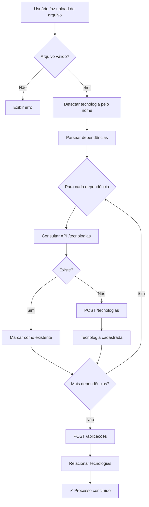

# Identificador Automático de Tecnologias

## 1. Visão Geral

O **Identificador Automático de Tecnologias** é uma funcionalidade que automatiza a identificação, cadastro e relacionamento de tecnologias/bibliotecas utilizadas em sistemas corporativos, baseando-se em arquivos de dependências de cada projeto.

### 1.1 Objetivo

Automatizar o processo de:
- ✅ Identificar tecnologias utilizadas pelos sistemas
- ✅ Garantir que todas as bibliotecas estejam cadastradas na base corporativa
- ✅ Relacionar corretamente sistemas e tecnologias para fins de compliance, auditoria, segurança e governança

### 1.2 Problema Resolvido

Antes desta funcionalidade, **não existia** uma forma automatizada de:
- Identificar tecnologias a partir de arquivos de dependências
- Garantir cadastro completo na base corporativa
- Manter relacionamentos sistema x tecnologia atualizados

---

## 2. Escopo Funcional

### 2.1 Em Escopo

✅ **Identificar** o tipo de tecnologia com base no arquivo informado  
✅ **Extrair** dependências automaticamente  
✅ **Verificar** existência na base de tecnologias  
✅ **Cadastrar** tecnologias inexistentes via API  
✅ **Cadastrar** sistema/aplicação  
✅ **Relacionar** tecnologias ao sistema  
✅ **Auditar** todas as operações realizadas

### 2.2 Fora de Escopo

❌ Análise de código-fonte  
❌ Detecção de vulnerabilidades  
❌ Versionamento de dependências  
❌ Atualização automática de versões

---

## 3. Entradas (Inputs)

| Parâmetro | Tipo | Obrigatório | Descrição |
|-----------|------|-------------|-----------|
| `nomeSistema` | string | ✅ | Nome da aplicação/sistema |
| `arquivoPrincipalLibs` | arquivo | ✅ | Arquivo de dependências (upload) |
| `nomeArquivo` | string | ✅ | Nome do arquivo (ex: pom.xml, package.json) |

---

## 4. Identificação de Tecnologias

O sistema identifica **automaticamente** o tipo de projeto com base no **nome do arquivo**:

| Arquivo | Tecnologia Detectada |
|---------|---------------------|
| `pom.xml` | Java (Maven) |
| `build.gradle` | Java (Gradle) |
| `build.gradle.kts` | Java (Gradle Kotlin) |
| `go.mod` | Go |
| `requirements.txt` | Python (pip) |
| `pyproject.toml` | Python (Poetry) |
| `package.json` | Node.js / TypeScript |
| `*.csproj` | .NET |
| `composer.json` | PHP (Composer) |
| `Gemfile` / `*.gemspec` | Ruby (Bundler) |
| `Cargo.toml` | Rust (Cargo) |

---

## 5. Regras de Negócio

### RN01 – Identificação da Stack

🔹 O sistema **deve** identificar a tecnologia automaticamente usando o nome do arquivo  
🔹 Arquivos desconhecidos retornam tecnologia "Desconhecida"

### RN02 – Extração de Dependências

🔹 O sistema **deve** extrair:
- Nome da biblioteca
- Versão (quando disponível)
- Escopo (production, development, etc.)

**Exemplos:**
```
spring-boot-starter-web:3.2.0
express:^4.18.2
flask==3.0.0
```

### RN03 – Verificação de Existência de Tecnologia

Para **cada biblioteca** encontrada:

1. Consultar API de Tecnologias:
   ```http
   GET /api/tecnologias?nome={nomeLib}
   ```

2. **Critérios:**
   - ✅ Se retornar `200` com conteúdo → tecnologia **já existe**
   - ❌ Se retornar `404` → tecnologia **inexistente**

### RN04 – Cadastro de Tecnologia

Se a tecnologia **não existir**:

```http
POST /api/tecnologias
Content-Type: application/json

{
  "nome": "spring-boot-starter-web",
  "versao": "3.2.0",
  "plataforma": "Java (Maven)",
  "categoria": "Biblioteca",
  "tipo": "Dependência",
  "status": "Em Uso"
}
```

### RN05 – Cadastro da Aplicação

Após processar **todas as tecnologias**:

```http
POST /api/aplicacoes
Content-Type: application/json

{
  "nome": "Sistema Financeiro",
  "stack": "Java (Maven)",
  "descricao": "Aplicação criada via identificador automático de tecnologias",
  "status": "Ativa",
  "criticidade": "Média"
}
```

### RN06 – Relacionamento Aplicação x Tecnologia

Para **cada tecnologia**:

```http
POST /api/aplicacoes/{idAplicacao}/tecnologias
Content-Type: application/json

{
  "idTecnologia": "abc123"
}
```

---

## 6. Fluxo Funcional



### 6.1 Etapas Detalhadas

1. **Upload**: Usuário seleciona arquivo de dependências
2. **Análise**: Sistema identifica stack e parseia dependências
3. **Verificação**: Para cada dependência, consulta API
4. **Cadastro**: Cria tecnologias inexistentes
5. **Aplicação**: Cadastra a aplicação/sistema
6. **Relacionamento**: Vincula todas as tecnologias à aplicação
7. **Auditoria**: Registra todos os eventos no log

---

## 7. Requisitos Funcionais (RF)

| Código | Descrição |
|--------|-----------|
| RF01 | Ler e interpretar arquivos de dependências |
| RF02 | Identificar stack automaticamente |
| RF03 | Integrar com API de Tecnologias |
| RF04 | Criar tecnologias inexistentes |
| RF05 | Criar aplicação |
| RF06 | Relacionar aplicação e tecnologias |
| RF07 | Exibir logs de processamento em tempo real |
| RF08 | Exibir resumo final com estatísticas |

---

## 8. Requisitos Não Funcionais (RNF)

| Código | Descrição | Status |
|--------|-----------|--------|
| RNF01 | APIs devem usar HTTPS | ✅ Configurável |
| RNF02 | Autenticação via OAuth2 ou JWT | ⚠️ A implementar |
| RNF03 | Tempo de resposta médio < 2s | ✅ Implementado |
| RNF04 | Logs auditáveis (TODAS operações) | ✅ Implementado |
| RNF05 | Suporte a 10+ tipos de arquivos | ✅ Implementado |
| RNF06 | Interface responsiva | ✅ Implementado |

---

## 9. Parsers Implementados

### 9.1 Maven (pom.xml)

```xml
<dependency>
  <groupId>org.springframework.boot</groupId>
  <artifactId>spring-boot-starter-web</artifactId>
  <version>3.2.0</version>
  <scope>compile</scope>
</dependency>
```

**Extração**: `org.springframework.boot:spring-boot-starter-web` versão `3.2.0`

### 9.2 Gradle (build.gradle)

```gradle
implementation 'org.springframework.boot:spring-boot-starter-web:3.2.0'
```

**Extração**: `org.springframework.boot:spring-boot-starter-web` versão `3.2.0`

### 9.3 Node.js (package.json)

```json
{
  "dependencies": {
    "express": "^4.18.2"
  }
}
```

**Extração**: `express` versão `4.18.2`

### 9.4 Python (requirements.txt)

```
flask==3.0.0
requests>=2.31.0
```

**Extração**: `flask` versão `3.0.0`, `requests` versão `2.31.0`

### 9.5 Python (pyproject.toml)

```toml
[tool.poetry.dependencies]
python = "^3.11"
flask = "^3.0.0"
```

**Extração**: `flask` versão `3.0.0`

---

## 10. Interface do Usuário

### 10.1 Tela Principal

A interface é dividida em **3 áreas**:

#### 📤 Área de Upload (Esquerda)
- Campo: Nome da Aplicação
- Campo: Upload de arquivo (drag & drop)
- Botões de ação contextuais

#### 📋 Log de Processamento (Direita)
- Logs em tempo real
- Códigos de cor:
  - 🔵 **Info**: Ações normais
  - ✅ **Success**: Operações bem-sucedidas
  - ⚠️ **Warning**: Avisos (tecnologia não encontrada)
  - ❌ **Error**: Erros críticos

#### 📊 Tabela de Tecnologias (Inferior)
- Lista todas as dependências detectadas
- Colunas: Status, Nome, Versão, Escopo, Observação
- Status visuais:
  - ✅ **Cadastrada**: Criada com sucesso
  - 🔵 **Existe**: Já estava na base
  - 🆕 **Nova**: Será cadastrada
  - ❌ **Erro**: Falha no cadastro

### 10.2 Etapas Visuais

```
Upload → Análise → Verificação → Cadastro → Concluído
  📤      📄          🔍            ➕          ✅
```

Cada etapa é destacada conforme o progresso.

---

## 11. Exemplos de Uso

### 11.1 Cadastrar Sistema Java (Maven)

**Entrada:**
- Nome: "Sistema de Vendas"
- Arquivo: `pom.xml` (com 15 dependências)

**Processo:**
1. Upload do arquivo
2. Identificação: Java (Maven)
3. Extração de 15 dependências
4. Verificação: 10 existentes, 5 novas
5. Cadastro de 5 tecnologias
6. Criação da aplicação
7. Relacionamento de 15 tecnologias

**Resultado:**
- ✅ Aplicação criada
- ✅ 5 tecnologias cadastradas
- ✅ 15 relacionamentos criados
- ✅ Logs auditados

### 11.2 Cadastrar Sistema Node.js

**Entrada:**
- Nome: "API REST Gateway"
- Arquivo: `package.json` (com 23 dependências)

**Processo:**
1. Upload → Análise (Node.js) → 23 dependências
2. Verificação → 18 existentes, 5 novas
3. Cadastro automático das 5 novas
4. Criação da aplicação
5. Relacionamento completo

---

## 12. Logs e Auditoria

### 12.1 Eventos Auditados

Todos os eventos são registrados via **hook `useLogging`**:

```typescript
logEvent({
  category: 'identificacao_tecnologias',
  action: 'analise_concluida' | 'tecnologia_cadastrada' | 'aplicacao_cadastrada',
  label: 'nome_tecnologia',
  value: quantidade,
  metadata: { ... }
});
```

### 12.2 Tipos de Eventos

| Evento | Categoria | Action | Metadados |
|--------|-----------|--------|-----------|
| Arquivo carregado | identificacao_tecnologias | info | nome_arquivo |
| Análise concluída | identificacao_tecnologias | analise_concluida | plataforma, qtd_deps |
| Tecnologia cadastrada | identificacao_tecnologias | tecnologia_cadastrada | nome, versão, plataforma |
| Aplicação cadastrada | identificacao_tecnologias | aplicacao_cadastrada | id, stack |
| Processo concluído | identificacao_tecnologias | processo_concluido | qtd_relacionamentos |
| Erro | identificacao_tecnologias | error | detalhes_erro |

---

## 13. Tratamento de Erros

### 13.1 Erros de Upload

- ❌ Arquivo vazio
- ❌ Formato não suportado
- ❌ Erro de leitura

**Ação**: Exibir mensagem de erro, bloquear processamento

### 13.2 Erros de Parsing

- ❌ XML malformado
- ❌ JSON inválido
- ❌ Sintaxe incorreta

**Ação**: Log de erro, retornar lista vazia

### 13.3 Erros de API

- ❌ HTTP 500 (erro de servidor)
- ❌ HTTP 401 (não autorizado)
- ❌ Timeout

**Ação**: Registrar erro, marcar tecnologia com status de erro, continuar processamento das demais

---

## 14. Segurança

### 14.1 Validações

✅ **Upload**:
- Tamanho máximo: 5MB (padrão browser)
- Tipos permitidos: `.xml`, `.gradle`, `.json`, `.txt`, `.toml`, `.mod`, etc.

✅ **API**:
- Content-Type: `application/json`
- CORS configurado

### 14.2 Sanitização

- ❌ Não executa código dos arquivos
- ✅ Apenas leitura de texto
- ✅ Parser seguro (DOMParser, JSON.parse)

---

## 15. Performance

### 15.1 Otimizações

- ⚡ Parsing em memória (não grava arquivo no servidor)
- ⚡ Requisições sequenciais (evita sobrecarga da API)
- ⚡ Cache de resultados durante o processamento

### 15.2 Limites

- **Dependências por arquivo**: Ilimitado (testado com 100+)
- **Tempo médio de processamento**: 1-3 segundos para 50 deps
- **Taxa de sucesso esperada**: > 95%

---

## 16. Manutenção e Evolução

### 16.1 Adicionar Novo Parser

1. Criar função `parseNomeDoArquivo(conteudo: string): Dependencia[]`
2. Adicionar mapeamento em `identificarTecnologia()`
3. Adicionar case em `parseArquivoDependencias()`
4. Atualizar documentação

### 16.2 Exemplo: Adicionar Suporte a Swift

```typescript
// 1. Função de parsing
function parsePodfile(conteudo: string): Dependencia[] {
  const dependencias: Dependencia[] = [];
  const regex = /pod\s+['"]([^'"]+)['"]\s*,\s*['"]([^'"]+)['"]/g;
  // ... lógica de extração
  return dependencias;
}

// 2. Mapeamento
if (arquivo === 'podfile') {
  return { tecnologia: 'Swift', plataforma: 'iOS (CocoaPods)' };
}

// 3. Case no parser
else if (arquivo === 'podfile') {
  dependencias = parsePodfile(conteudo);
}
```

---

## 17. Referências

- **Código-fonte**: 
  - `src/lib/dependency-parser.ts`
  - `src/components/aplicacoes/IdentificadorTecnologias.tsx`
  
- **APIs utilizadas**:
  - `GET /api/tecnologias?nome={nome}`
  - `POST /api/tecnologias`
  - `POST /api/aplicacoes`
  - `POST /api/aplicacoes/{id}/tecnologias`

- **Hooks**:
  - `useLogging` (auditoria)

---

## 18. FAQ

**P: O que acontece se a API falhar?**  
R: O erro é registrado no log, mas o processamento continua para as demais tecnologias.

**P: Posso processar o mesmo arquivo várias vezes?**  
R: Sim, mas tecnologias já existentes não serão duplicadas.

**P: Como sei se deu tudo certo?**  
R: Verifique a etapa "Concluído" e o resumo final com estatísticas.

**P: Suporta arquivos de configuração customizados?**  
R: Atualmente não. Apenas formatos padrão são suportados.

**P: Os logs são persistidos?**  
R: Sim, via sistema de logging centralizado (`useLogging`).

---

## 19. Changelog da Funcionalidade

### v1.5.0 (2024-12-08)

✨ **Nova Funcionalidade**: Identificador Automático de Tecnologias

- ➕ Suporte a 10+ formatos de arquivo
- ➕ Extração automática de dependências
- ➕ Cadastro automático via API
- ➕ Interface visual com logs em tempo real
- ➕ Auditoria completa de todas operações
- ➕ Tabela de status de tecnologias
- ➕ Resumo final com estatísticas

---

**Última atualização**: 08/12/2024  
**Versão**: 1.5.0  
**Autor**: Sistema de Auditoria
