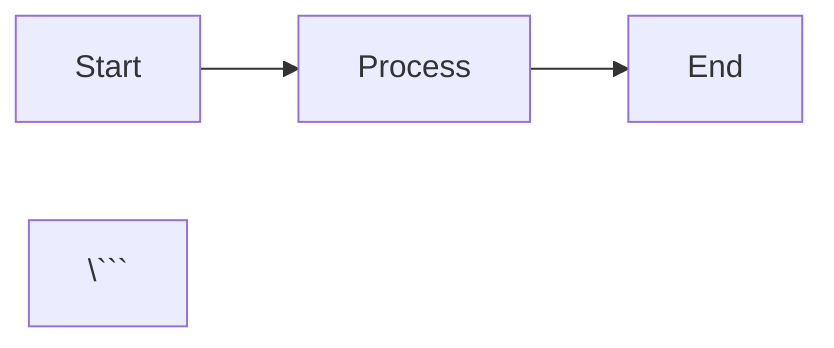

# Convenções do Projeto CodeWiki

## 📋 Organização de Arquivos

### Arquivos Markdown (.md)

**REGRA FUNDAMENTAL**: Todos os arquivos Markdown devem estar na pasta `docs/`.

#### Estrutura de Pastas (Compatível com MkDocs):

```
docs/
├── index.md                     # Página inicial (obrigatório MkDocs)
│
├── deployment/                  # 🚀 Deploy e produção
│   ├── DEPLOY-GUIDE.md
│   ├── DEPLOY-SUMMARY.md
│   ├── DOCKER-PRODUCTION-SETUP.md
│   └── TEST-PRODUCTION.md
│
├── guides/                      # 📖 Guias e tutoriais
│   └── GUIA-TESTE-PBIS-AZURE.md
│
├── issues/                      # 🐛 Problemas e soluções
│   └── ISSUE-COLABORADOR-WIZARD.md
│
├── setup/                       # ⚙️ Setup e configuração
│   ├── LGPD-IMPLEMENTATION.md
│   ├── LGPD-SETUP-INSTRUCTIONS.md
│   └── MYSQL-REPLICATION-FIX.md
│
├── api-catalog/                 # 🔌 Catálogo de APIs
│   ├── index.md
│   ├── specs/
│   └── openapi/
│
├── data-templates/              # 📦 Templates de dados
│   └── *.md
│
├── runbooks/                    # 📚 Runbooks operacionais
│   ├── index.md
│   └── database/
│
├── javascripts/                 # Scripts JS para MkDocs
├── styles/                      # CSS customizado
└── theme/                       # Tema customizado MkDocs

# Arquivos gerais (raiz de docs/)
├── CORRECOES-APLICADAS.md      # Histórico de correções
├── IMPLEMENTATION-SUMMARY.md   # Resumos de implementação
├── MKDOCS-README.md            # Documentação do MkDocs
├── INDEX.md                     # Índice de navegação
└── PROJECT-CONVENTIONS.md      # Este arquivo

README.md                # ÚNICA EXCEÇÃO: permanece na raiz do projeto
mkdocs.yml               # Configuração do MkDocs (raiz do projeto)
```

### Exceções:

1. **README.md** - Permanece na raiz do projeto (convenção GitHub/GitLab)
2. **mkdocs.yml** - Configuração do MkDocs na raiz do projeto
3. **data-templates/*.md** - Documentação de templates (subpasta de docs/)
4. **docs/index.md** - Página inicial obrigatória do MkDocs

### Categorias de Documentação:

| Categoria | Pasta | Tipo de Conteúdo | MkDocs Nav |
|-----------|-------|------------------|------------|
| **Deployment** | `docs/deployment/` | Deploy, produção, Docker, testes de produção | ✅ |
| **Guides** | `docs/guides/` | Tutoriais, guias de uso, HOWTOs | ✅ |
| **Issues** | `docs/issues/` | Problemas conhecidos, troubleshooting | ✅ |
| **Setup** | `docs/setup/` | Configuração inicial, instalação, migrations | ✅ |
| **API Catalog** | `docs/api-catalog/` | Especificações de APIs, OpenAPI, payloads | ✅ |
| **Data Templates** | `docs/data-templates/` | Templates de importação, exemplos CSV | ✅ |
| **Runbooks** | `docs/runbooks/` | Procedimentos operacionais, manutenção | ✅ |
| **Root docs/** | `docs/` | Documentação geral, correções, resumos | ✅ |

## 🐳 Integração com MkDocs

### Estrutura do Container

O projeto usa Docker para servir a documentação via MkDocs:

```yaml
# docker-compose.yml
mkdocs:
  build:
    context: .
    dockerfile: Dockerfile.mkdocs
  ports:
    - "8082:8082"
  volumes:
    - ./docs:/docs/docs:ro
    - ./mkdocs.yml:/docs/mkdocs.yml:ro
    - ./theme:/docs/theme:ro
```

### Executar Documentação Localmente

```bash
# Iniciar container MkDocs
docker-compose up mkdocs

# Acessar documentação
# http://localhost:8082
```

### Arquivo index.md Obrigatório

O MkDocs requer um arquivo `docs/index.md` como página inicial. Este arquivo deve:
- Ter conteúdo relevante (não pode ser vazio)
- Servir como landing page da documentação
- Linkar para as principais seções

### Atualizar Navegação (mkdocs.yml)

Ao adicionar novos documentos, atualize a seção `nav:` no `mkdocs.yml`:

```yaml
nav:
  - "🏠 Início":
      - "Bem-vindo": "index.md"
  
  - "🚀 Deployment":
      - "Guia de Deploy": "deployment/DEPLOY-GUIDE.md"
      - "Docker Produção": "deployment/DOCKER-PRODUCTION-SETUP.md"
  
  - "📖 Guias":
      - "Teste PBIS Azure": "guides/GUIA-TESTE-PBIS-AZURE.md"
  
  - "⚙️ Setup":
      - "LGPD Setup": "setup/LGPD-SETUP-INSTRUCTIONS.md"
      - "MySQL Replication": "setup/MYSQL-REPLICATION-FIX.md"
```

### Plugins MkDocs Disponíveis

O container inclui os seguintes plugins:
- `mkdocs-material` - Tema Material Design
- `pymdown-extensions` - Extensões markdown avançadas
- `mkdocs-minify-plugin` - Minificação de arquivos
- `mkdocs-awesome-pages-plugin` - Organização automática de páginas
- `mkdocs-include-markdown-plugin` - Incluir markdown de outros arquivos
- `mkdocs-swagger-ui-tag` - Renderizar especificações OpenAPI

## 🎯 Regras de Nomenclatura

### Arquivos Markdown:

- **Formato**: `NOME-DO-ARQUIVO.md` (UPPER-KEBAB-CASE)
- **Prefixos comuns**:
  - `GUIDE-`: Guias e tutoriais
  - `SETUP-`: Instruções de setup
  - `DEPLOY-`: Documentação de deployment
  - `ISSUE-`: Documentação de problemas
  - `README-`: Documentação específica de um módulo

### Exemplos:
```
✅ docs/guides/GUIDE-API-USAGE.md
✅ docs/setup/SETUP-DATABASE.md
✅ docs/deployment/DEPLOY-AWS.md
✅ docs/issues/ISSUE-PERFORMANCE-FIX.md

❌ MY-GUIDE.md (na raiz)
❌ setup-guide.md (lowercase)
❌ ApiUsage.md (PascalCase)
```

## 📝 Processo para Novos Arquivos

### 1. Criar o Arquivo Markdown

1. **Identifique a categoria** do documento
2. **Crie o arquivo** na pasta apropriada de `docs/`
3. **Use nomenclatura consistente** (UPPER-KEBAB-CASE)
4. **Adicione front matter** (opcional, mas recomendado):

```markdown
---
title: Título do Documento
description: Breve descrição
tags:
  - categoria
  - tópico
---

# Título do Documento

Conteúdo...
```

### 2. Atualizar mkdocs.yml

Adicione o documento na navegação:

```yaml
nav:
  - "📂 Categoria":
      - "Nome do Doc": "pasta/NOME-ARQUIVO.md"
```

### 3. Testar Localmente

```bash
# Iniciar MkDocs
docker-compose up mkdocs

# Verificar em http://localhost:8082
# - Navegação funciona
# - Links internos funcionam
# - Imagens carregam
```

### 4. Commit e Push

```bash
git add docs/pasta/NOME-ARQUIVO.md mkdocs.yml
git commit -m "docs: adicionar NOME-ARQUIVO"
git push
```

## 🔄 Migração de Arquivos Existentes

Se encontrar arquivos `.md` na raiz (exceto README.md):

```bash
# 1. Identificar categoria
# 2. Mover para pasta apropriada
mv ARQUIVO-EXEMPLO.md docs/categoria-apropriada/

# 3. Atualizar referências no mkdocs.yml
# Editar mkdocs.yml e adicionar na seção nav:

# 4. Verificar links quebrados
grep -r "ARQUIVO-EXEMPLO.md" docs/ README.md

# 5. Atualizar links
# De: [Link](../ARQUIVO-EXEMPLO.md)
# Para: [Link](categoria-apropriada/ARQUIVO-EXEMPLO.md)

# 6. Testar no MkDocs
docker-compose up mkdocs
```

## 🎨 Recursos de Markdown Avançados

### Admonitions (Alertas)

```markdown
!!! note "Nota"
    Informação importante

!!! warning "Atenção"
    Cuidado com isso

!!! danger "Perigo"
    Não faça isso!

!!! tip "Dica"
    Melhor prática

!!! info "Informação"
    FYI
```

### Abas (Tabs)

```markdown
=== "Tab 1"
    Conteúdo da aba 1

=== "Tab 2"
    Conteúdo da aba 2
```

### Diagramas Mermaid

```markdown


### Incluir Código com Highlight

```markdown
```python title="exemplo.py" linenums="1"
def hello():
    print("Hello World")
\```
```

### Links Internos

```markdown
# Links relativos (preferidos no MkDocs)
[Outro Doc](../setup/LGPD-SETUP-INSTRUCTIONS.md)

# Links absolutos (da raiz de docs/)
[API Reference](/API-REFERENCIA-COMPLETA/)

# Âncoras
[Seção](#nome-da-secao)
```

## 🚫 Arquivos que NÃO devem ir para docs/

- `package.json`, `tsconfig.json`, etc. (configuração de projeto)
- Arquivos de código-fonte (`.js`, `.ts`, `.tsx`, `.vue`, etc.)
- `docker-compose.yml`, `Dockerfile*` (infraestrutura na raiz)
- `.gitignore`, `.env*` (configuração de ambiente)
- `mkdocs.yml` (fica na raiz do projeto)
- `node_modules/`, `dist/`, `build/` (gerados automaticamente)

## 📚 Referências no Código e Documentos

### Em Documentos Markdown

```markdown
# ✅ Correto (links relativos MkDocs)
Ver [Guia de Deploy](deployment/DEPLOY-GUIDE.md)
Ver [Setup LGPD](setup/LGPD-SETUP-INSTRUCTIONS.md)
Ver [API Reference](../API-REFERENCIA-COMPLETA.md)

# ❌ Incorreto (caminhos antigos da raiz)
Ver [Guia de Deploy](../DEPLOY-GUIDE.md)
Ver [Setup LGPD](../LGPD-SETUP-INSTRUCTIONS.md)
```

### Em Arquivos de Código

```javascript
// ✅ Correto
// Ver documentação: docs/setup/LGPD-SETUP-INSTRUCTIONS.md
// Veja: http://localhost:8082/setup/LGPD-SETUP-INSTRUCTIONS/

// ❌ Incorreto
// Ver: LGPD-SETUP-INSTRUCTIONS.md
```

### No README.md

```markdown
# ✅ Correto
- [Documentação Completa](docs/INDEX.md)
- [Guia de Deploy](docs/deployment/DEPLOY-GUIDE.md)
- 📚 [Ver documentação no MkDocs](http://localhost:8082)

# ❌ Incorreto
- [Guia de Deploy](DEPLOY-GUIDE.md)
```

## 🔍 Checklist para Commits

Antes de fazer commit de novos arquivos Markdown:

- [ ] Arquivo está em `docs/` (ou subpasta apropriada)
- [ ] Não está na raiz (exceto `README.md` e `mkdocs.yml`)
- [ ] Nomenclatura segue UPPER-KEBAB-CASE
- [ ] Está na subcategoria correta (deployment, guides, setup, etc.)
- [ ] Adicionado ao `mkdocs.yml` na seção `nav:`
- [ ] Front matter incluído (opcional mas recomendado)
- [ ] Links internos usam caminhos relativos
- [ ] Testado no MkDocs local (`docker-compose up mkdocs`)
- [ ] README.md atualizado (se necessário)
- [ ] Sem warnings no build do MkDocs

## 🛠️ Ferramentas de Verificação

### Verificar arquivos MD fora de lugar:

```bash
# Listar arquivos MD na raiz (exceto README.md e mkdocs.yml)
ls -1 *.md 2>/dev/null | grep -v -E "^README.md$"

# Se retornar algo, mover para docs/
```

### Verificar estrutura de docs:

```bash
# Ver organização atual
tree docs/ -L 2 -I 'node_modules'

# Ver apenas arquivos MD
find docs/ -name "*.md" -type f | sort
```

### Verificar navegação do MkDocs:

```bash
# Verificar sintaxe do mkdocs.yml
docker-compose run --rm mkdocs mkdocs build --strict

# Iniciar servidor de desenvolvimento
docker-compose up mkdocs

# Verificar em http://localhost:8082
```

### Verificar links quebrados:

```bash
# Procurar links para arquivos movidos
grep -r "](../" docs/ | grep -v ".git"

# Procurar links absolutos que deveriam ser relativos
grep -r "](/Users/" docs/ | grep -v ".git"
```

## 🚀 Deploy da Documentação

### Ambiente de Desenvolvimento

```bash
# Iniciar MkDocs em modo desenvolvimento
docker-compose up mkdocs

# Acessa: http://localhost:8082
# Hot reload: arquivos são recarregados automaticamente
```

### Build para Produção

```bash
# Gerar site estático
docker-compose run --rm mkdocs mkdocs build

# Arquivos gerados em: site/
# Servir com nginx ou qualquer servidor web estático
```

### Deploy Automatizado

O MkDocs pode ser integrado com:
- GitHub Pages
- GitLab Pages
- Netlify
- Vercel
- AWS S3 + CloudFront

Exemplo para GitHub Pages:

```yaml
# .github/workflows/deploy-docs.yml
name: Deploy Docs
on:
  push:
    branches: [main]
    paths:
      - 'docs/**'
      - 'mkdocs.yml'
jobs:
  deploy:
    runs-on: ubuntu-latest
    steps:
      - uses: actions/checkout@v3
      - uses: actions/setup-python@v4
        with:
          python-version: 3.x
      - run: pip install mkdocs-material
      - run: mkdocs gh-deploy --force
```

---

**Última atualização**: 12 de Janeiro de 2026  
**Status**: ✅ ATIVO  
**Responsável**: Equipe de Desenvolvimento
