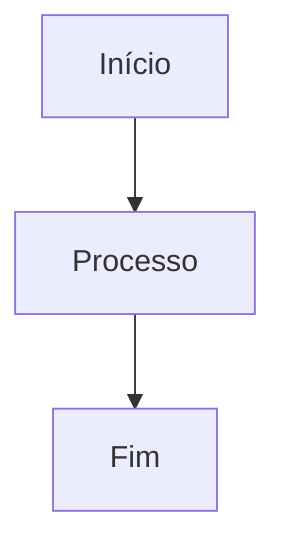

# Guia de Teste: Funcionalidade de Impressão

## ✅ Problemas Corrigidos

1. **Erro 500 ao criar documentação** - Endpoint funcionando corretamente
2. **PDF vazio na impressão** - Conteúdo agora aparece formatado

## 🧪 Como Testar a Impressão

### Passo 1: Acessar a Tela
1. Abra o navegador em `http://localhost:3000`
2. Navegue até **Documentação de Projetos**

### Passo 2: Criar ou Visualizar Documento

#### Opção A: Criar Documento de Teste
Clique em **Nova Documentação** e use este conteúdo:

```markdown
# Teste de Impressão

## Introdução
Este é um **teste completo** de impressão com vários elementos.

### Lista de Itens
- Item 1 com *itálico*
- Item 2 com **negrito**
- Item 3 com `código inline`

### Código TypeScript
```typescript
interface Usuario {
  id: string;
  nome: string;
  email: string;
}
```

### Tabela
| Nome | Tipo | Descrição |
|------|------|-----------|
| id | string | Identificador |
| nome | string | Nome completo |

### Diagrama


### Citação
> "A impressão deve manter toda a formatação Markdown"

---
**Fim do teste**
```

#### Opção B: Usar Documento Existente
Se já existir "Guia de Arquitetura do Sistema", use-o para testar.

### Passo 3: Imprimir

#### Método 1: Da Tabela
1. Localize o documento na lista
2. Clique no botão **🖨️ Printer** (terceiro botão)
3. **Aguarde 1-2 segundos** (renderização automática)
4. A janela de impressão do navegador abrirá

#### Método 2: Do Dialog
1. Clique no botão **👁️ Visualizar**
2. No dialog que abrir, clique em **Imprimir** (canto superior direito)
3. **Aguarde 1-2 segundos**
4. A janela de impressão abrirá

### Passo 4: Configurar Impressão

**Chrome/Edge:**
- **Destino:** Salvar como PDF
- **Layout:** Retrato
- **Margens:** Padrão
- **Mais configurações:**
  - ✅ Cores de plano de fundo e imagens (IMPORTANTE!)
  - ✅ Gráficos
  - Escala: 100%

**Firefox:**
- **Destino:** Salvar em PDF
- **Orientação:** Vertical
- **Margens:** Normal
- ✅ **Imprimir planos de fundo** (IMPORTANTE!)

### Passo 5: Gerar PDF
1. Clique em **Salvar**
2. Escolha o local e nome do arquivo
3. Abra o PDF gerado

## ✅ Checklist de Validação

Ao abrir o PDF, verifique se aparecem:

### Formatação Básica
- [ ] Título principal em tamanho grande e negrito
- [ ] Subtítulos hierárquicos (H2, H3)
- [ ] Parágrafos justificados
- [ ] **Negrito** em destaque
- [ ] *Itálico* em ângulo
- [ ] `Código inline` com fundo cinza

### Elementos Complexos
- [ ] Blocos de código com fundo cinza e borda
- [ ] Syntax highlighting (estrutura, não cores)
- [ ] Tabelas com bordas sólidas
- [ ] Cabeçalho de tabela com fundo cinza escuro
- [ ] Listas com bullets/números
- [ ] Citações com barra lateral

### Diagramas
- [ ] Diagrama Mermaid renderizado como imagem
- [ ] Diagrama não cortado
- [ ] Proporções mantidas

### Layout Geral
- [ ] Margens adequadas (±15mm)
- [ ] Sem elementos de interface (botões, sidebar)
- [ ] Quebras de página inteligentes
- [ ] Títulos não separados do conteúdo
- [ ] Tabelas/códigos não cortados

## ❌ O que NÃO deve aparecer

- ❌ Barra lateral (sidebar)
- ❌ Botões de ação
- ❌ Cabeçalho do sistema
- ❌ Dialog borders
- ❌ Background escuro (se em dark mode)

## 🐛 Troubleshooting

### Problema: PDF Vazio
**Causa:** Configuração "Imprimir planos de fundo" desativada  
**Solução:** 
1. Cancele a impressão
2. Tente novamente
3. Ative "Cores de plano de fundo e imagens" (Chrome) ou "Imprimir planos de fundo" (Firefox)

### Problema: Código sem Fundo Cinza
**Causa:** Mesma acima  
**Solução:** Ative impressão de planos de fundo nas configurações

### Problema: Mermaid não Aparece
**Causa:** Renderização incompleta  
**Solução:** 
1. Aguarde 2-3 segundos após clicar em Imprimir
2. Se não funcionar, atualize a página (F5) e tente novamente

### Problema: Conteúdo Cortado
**Causa:** Escala de impressão  
**Solução:** Reduza escala para 90% ou 85% nas configurações

### Problema: Texto Muito Pequeno
**Causa:** Escala muito baixa  
**Solução:** Aumente para 100% ou até 110%

## 📊 Resultados Esperados

### Tempo de Processamento
- Click no botão → Dialog impressão: **1.5 segundos**
- Renderização completa: **até 2 segundos**
- Total: **< 3 segundos**

### Qualidade do PDF
- **Resolução:** Alta (nativa do navegador)
- **Fontes:** Preservadas (Arial, Courier New)
- **Cores:** Apenas estruturais (preto, cinza)
- **Tamanho:** 50-200 KB por página (depende de diagramas)

## 📝 Exemplo de Resultado Correto

Ao abrir o PDF, você deve ver algo como:

```
┌────────────────────────────────────────┐
│                                        │
│  Teste de Impressão                    │
│  ──────────────────────────────────    │
│                                        │
│  Introdução                            │
│  Este é um teste completo de           │
│  impressão com vários elementos.       │
│                                        │
│  Lista de Itens                        │
│  • Item 1 com itálico                  │
│  • Item 2 com negrito                  │
│  • Item 3 com código inline            │
│                                        │
│  Código TypeScript                     │
│  ┌──────────────────────────────────┐ │
│  │ interface Usuario {              │ │
│  │   id: string;                    │ │
│  │   nome: string;                  │ │
│  │   email: string;                 │ │
│  │ }                                │ │
│  └──────────────────────────────────┘ │
│                                        │
│  [Tabela com bordas]                   │
│  [Diagrama Mermaid renderizado]        │
│                                        │
└────────────────────────────────────────┘
```

## ✅ Confirmação Final

Se todos os itens do checklist estiverem marcados e o PDF estiver formatado corretamente, a funcionalidade está **100% operacional**.

## 📞 Suporte

Se encontrar problemas:
1. Verifique o console do navegador (F12)
2. Confirme que o servidor está rodando (http://localhost:3000)
3. Verifique documentação em: [FUNCIONALIDADE-IMPRESSAO-DOCUMENTACAO.md](./FUNCIONALIDADE-IMPRESSAO-DOCUMENTACAO.md)
4. Consulte o fix: [FIX-IMPRESSAO-DOCUMENTACAO.md](./FIX-IMPRESSAO-DOCUMENTACAO.md)

---

**Última atualização:** 17/01/2026  
**Versão:** 1.1.0  
**Status:** ✅ Totalmente funcional
