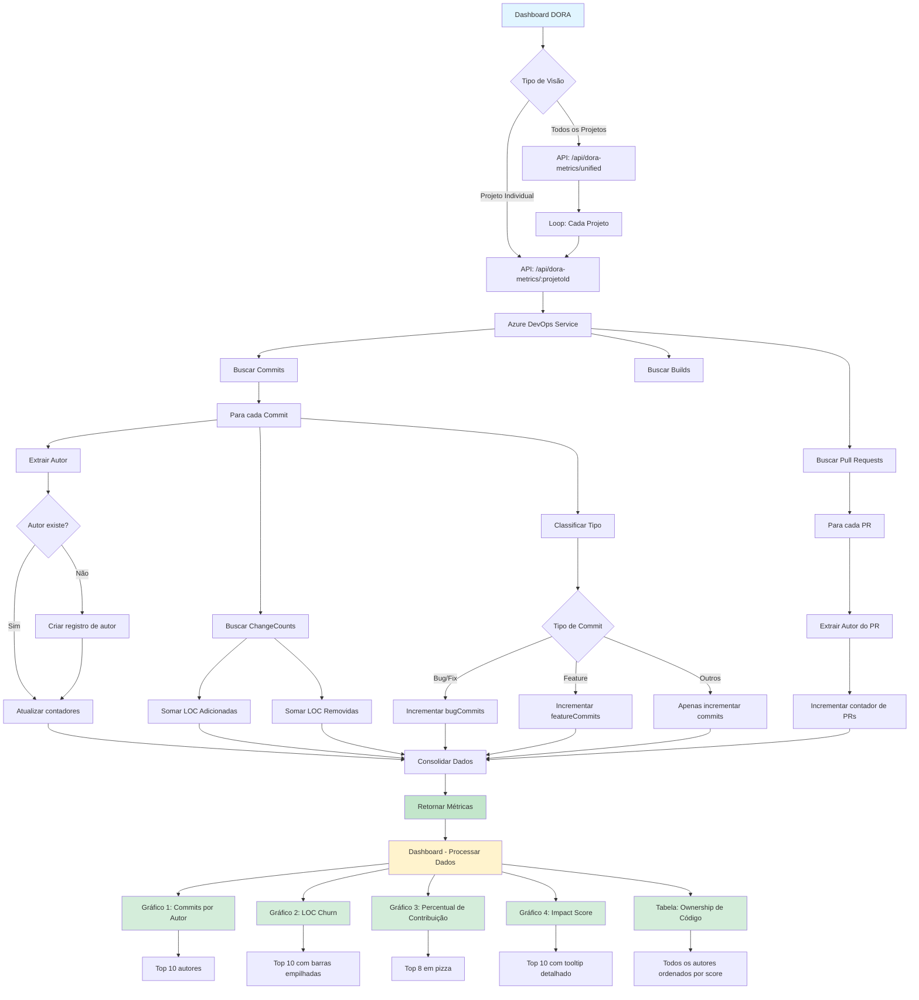

```mermaid
graph TD
    A[Dashboard DORA] --> B{Tipo de Visão}
    B -->|Projeto Individual| C[API: /api/dora-metrics/:projetoId]
    B -->|Todos os Projetos| D[API: /api/dora-metrics/unified]
    
    C --> E[Azure DevOps Service]
    D --> F[Loop: Cada Projeto]
    F --> C
    
    E --> G[Buscar Commits]
    E --> H[Buscar Pull Requests]
    E --> I[Buscar Builds]
    
    G --> J[Para cada Commit]
    J --> K[Extrair Autor]
    J --> L[Buscar ChangeCounts]
    J --> M[Classificar Tipo]
    
    K --> N{Autor existe?}
    N -->|Não| O[Criar registro de autor]
    N -->|Sim| P[Atualizar contadores]
    O --> P
    
    L --> Q[Somar LOC Adicionadas]
    L --> R[Somar LOC Removidas]
    
    M --> S{Tipo de Commit}
    S -->|Bug/Fix| T[Incrementar bugCommits]
    S -->|Feature| U[Incrementar featureCommits]
    S -->|Outros| V[Apenas incrementar commits]
    
    H --> W[Para cada PR]
    W --> X[Extrair Autor do PR]
    X --> Y[Incrementar contador de PRs]
    
    P --> Z[Consolidar Dados]
    Q --> Z
    R --> Z
    T --> Z
    U --> Z
    V --> Z
    Y --> Z
    
    Z --> AA[Retornar Métricas]
    AA --> AB[Dashboard - Processar Dados]
    
    AB --> AC[Gráfico 1: Commits por Autor]
    AB --> AD[Gráfico 2: LOC Churn]
    AB --> AE[Gráfico 3: Percentual de Contribuição]
    AB --> AF[Gráfico 4: Impact Score]
    AB --> AG[Tabela: Ownership de Código]
    
    AC --> AH[Top 10 autores]
    AD --> AI[Top 10 com barras empilhadas]
    AE --> AJ[Top 8 em pizza]
    AF --> AK[Top 10 com tooltip detalhado]
    AG --> AL[Todos os autores ordenados por score]
    
    style A fill:#e1f5ff
    style AA fill:#c3e6cb
    style AB fill:#fff3cd
    style AC fill:#d4edda
    style AD fill:#d4edda
    style AE fill:#d4edda
    style AF fill:#d4edda
    style AG fill:#d4edda
```
